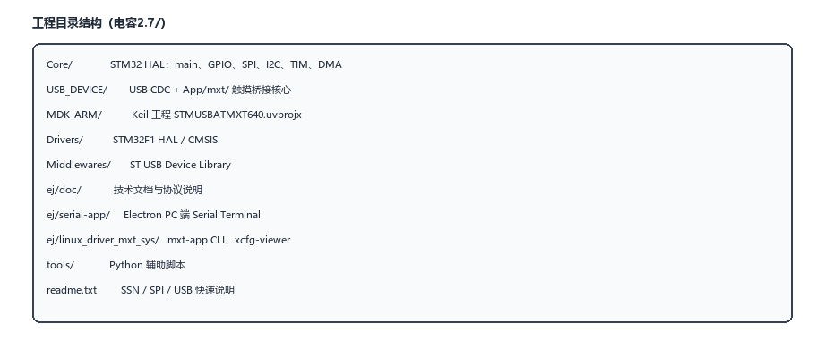
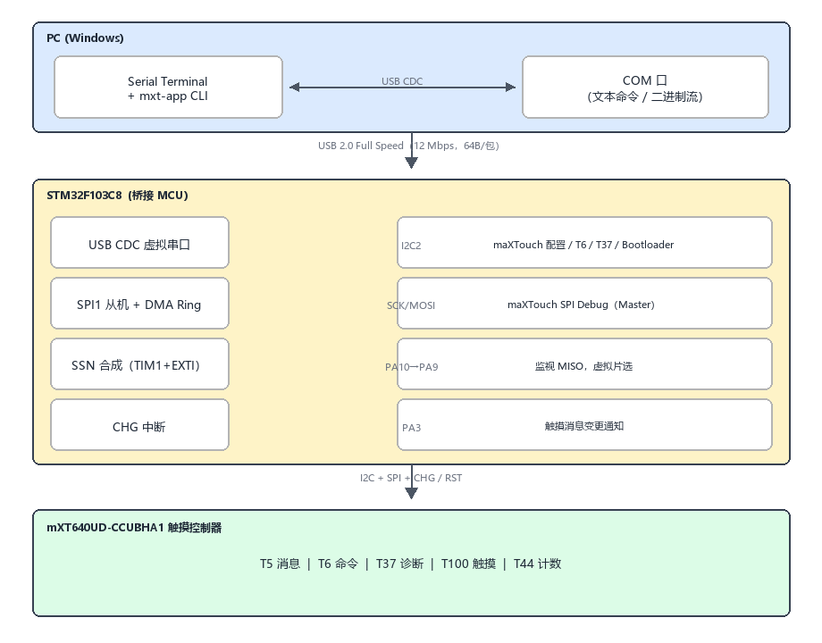
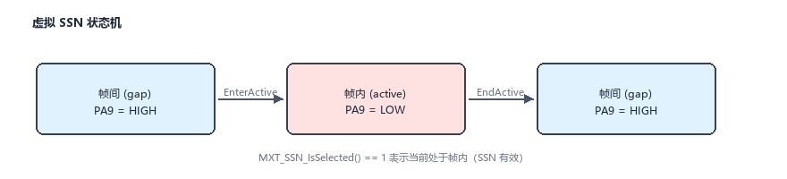
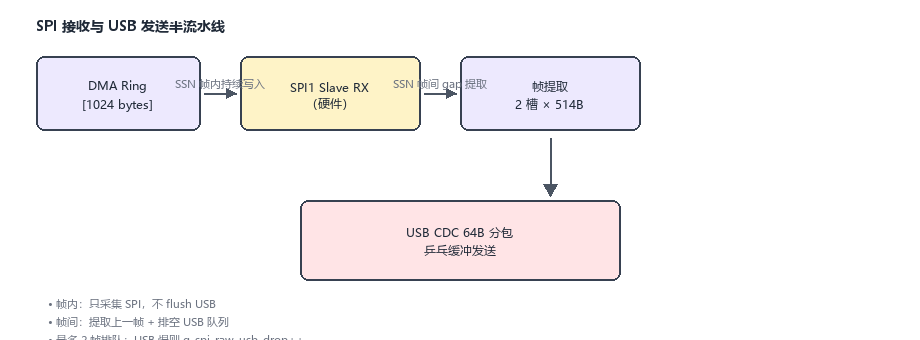
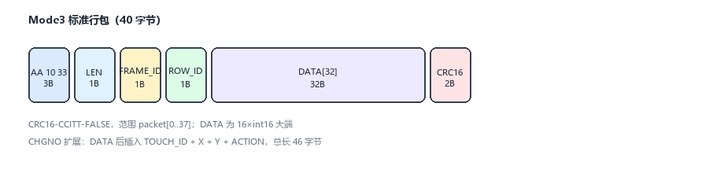
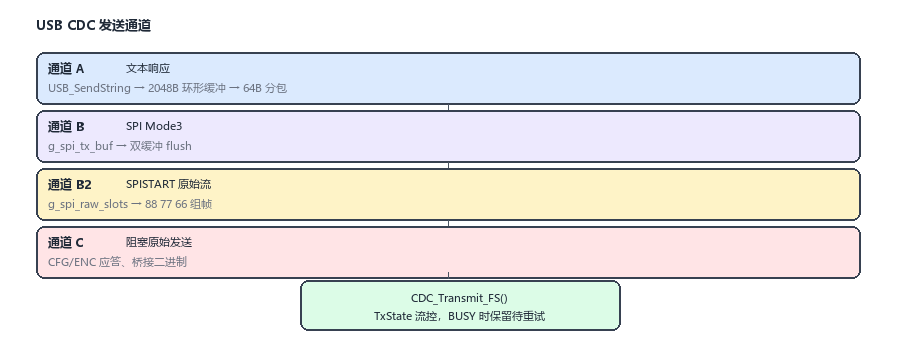
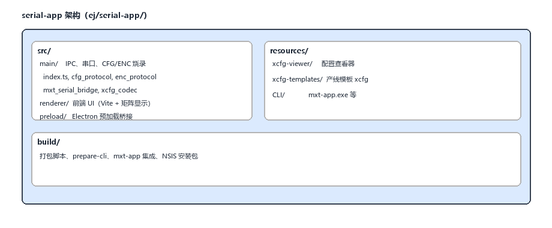

# STMUSBATMXT640 工程技术文档

> **版本**：test-V2.7  
> **日期**：2026-06-22  
> **参考协议**：Microchip DS40002353A — *mXT640UD-CCUBHA1 1.0 Family Protocol Guide*（`ej/doc/40002353A.pdf`）  
> **调试端口参考**：QTAN0050 — *Using the maXTouch Debug Port*（`ej/doc/Level1_QTAN0050_DS40001898_A_Debug_Port-20260525150740.md`）

---

## 目录

1. [项目概述](#1-项目概述)
2. [系统架构](#2-系统架构)
3. [硬件设计](#3-硬件设计)
4. [maXTouch 对象协议基础](#4-maxtouch-对象协议基础)
5. [调试端口与 SPI 数据流](#5-调试端口与-spi-数据流)
6. [MCU 固件架构](#6-mcu-固件架构)
7. [通信协议](#7-通信协议)
8. [PC 端软件（serial-app）](#8-pc-端软件serial-app)
9. [典型工作流程](#9-典型工作流程)
10. [开发与构建](#10-开发与构建)
11. [故障排查](#11-故障排查)
12. [附录与相关文档](#12-附录与相关文档)

---

## 1. 项目概述

### 1.1 工程定位

**STMUSBATMXT640** 是一套面向 **Microchip maXTouch mXT640UD-CCUBHA1** 电容触摸控制器的 **USB 调试桥接方案**。核心目标：

- 通过 **I2C** 配置触摸芯片、读取对象表与诊断数据（T37）；
- 通过 **SPI 从机** 抓取触摸芯片 **硬件调试口** 输出的高速原始数据；
- 经 **USB CDC 虚拟串口** 上传至 PC，供调参、产测、固件烧录与可视化分析。

本工程在 STM32F103 上实现桥接固件，并配套 Electron 桌面应用 **Serial Terminal**（`ej/serial-app`）及 **mxt-app** CLI 工具链。

### 1.2 目标芯片

| 项目 | 说明 |
|------|------|
| 触摸控制器 | **mXT640UD-CCUBHA1**（Family ID `0xA6`，Variant ID `0x15`） |
| 同族兼容 | mXT448UD-CCUBHA1（Variant ID `0x16`） |
| 协议版本 | 1.0（Firmware Version 字段 `0x10`） |
| 传感矩阵 | **32×20 = 640 节点**（Info Block：Matrix X=32, Y=20；以 `INFO` 读回为准） |

### 1.3 工程目录结构



*图 1-1：STMUSBATMXT640 工程主要目录*

---

## 2. 系统架构

### 2.1 总体数据流



*图 2-1：PC ↔ STM32 桥接板 ↔ mXT640 总体数据流（USB CDC / I2C / SPI / CHG）*

**数据流说明：**

1. **PC 层**：Serial Terminal 与 mxt-app CLI 经 USB CDC 虚拟 COM 口与桥接板通信（文本命令或二进制流）。
2. **MCU 层**：STM32F103 同时承担 USB 转发、I2C 配置/诊断、SPI 从机抓调试口、SSN 帧边界合成、CHG 消息中断。
3. **触摸芯片层**：mXT640UD 通过 I2C 接受配置与 T37 诊断，通过 SPI Master 输出 DEBUG 数据，通过 CHG 通知新消息。

> 架构图源文件：`ej/doc/scripts/gen_all_diagrams.py`，修改后运行 `python ej/doc/scripts/gen_all_diagrams.py` 可重新生成全部 PNG。

### 2.2 双通道通信模型

| 通道 | 物理接口 | 方向 | 用途 |
|------|----------|------|------|
| **配置/诊断通道** | I2C2 | MCU ↔ 触摸芯片 | 对象表读取、T6 命令、T37 诊断页、Bootloader 烧录 |
| **高速原始流通道** | SPI1（从机） | 触摸芯片 → MCU | DEBUGCTRL2 使能后的 SPI 调试数据 |
| **主机交互通道** | USB CDC | MCU ↔ PC | 文本命令、Mode3 二进制包、CFG/ENC 协议帧 |
| **事件通知** | CHG (PA3) | 触摸芯片 → MCU | 有新触摸/状态消息时触发 I2C 读 T5 |

---

## 3. 硬件设计

### 3.1 MCU 选型

| 参数 | 值 |
|------|-----|
| 型号 | **STM32F103C8**（Cortex-M3，72 MHz） |
| Flash / RAM | 64 KB / 20 KB |
| USB | 内置 Full Speed Device |
| 开发环境 | STM32CubeMX + Keil MDK-ARM |

系统时钟：HSE + PLL ×9 → **72 MHz SYSCLK**；USB 时钟来自 PLL / 1.5。

### 3.2 引脚分配

定义见 `Core/Inc/main.h`：

| 引脚 | 信号名 | 方向 | 功能说明 |
|------|--------|------|----------|
| **PA3** | CHG_EXTI3 | 输入/EXTI | maXTouch CHG 引脚，消息就绪中断 |
| **PA4** | SSN | — | 硬件 SSN（本设计未用作 SPI NSS） |
| **PA5** | SPI1_SCK | 输入 | SPI 从机时钟（触摸芯片为 Master） |
| **PA7** | SPI_MOSI | 输入 | SPI 数据输入（RX-only 从机） |
| **PA9** | SSN_OUT | 输出 | **虚拟 SSN**，推挽，帧间 idle 为高 |
| **PA10** | CLK_MON | 输入/EXTI | **MISO 信号监视**，双边沿触发 |
| **PA11/PA12** | USB DM/DP | — | USB Full Speed |
| **PA15** | USB_EN | 输出 | USB 收发器使能（上电拉高 100ms 后拉低） |
| **PB1** | RST | 输出 | 触摸芯片复位（低 40ms 脉冲） |
| **PB10** | IIC_SCL | 开漏 | I2C2 时钟 |
| **PB11** | IIC_SDA | 开漏 | I2C2 数据 |
| **PB12** | ADDSEL | — | I2C 地址选择 |
| **PB13** | IICMODE | — | I2C 模式控制 |
| **PB14** | SYNC | — | 同步信号 |
| **PB15** | NOISE_IN | 输入 | 噪声输入 |
| **PC13** | LED | 输出 | 状态指示 |

### 3.3 I2C 地址

定义见 `USB_DEVICE/App/mxt/mxt_config.h`：

| 模式 | 地址 | 说明 |
|------|------|------|
| Application Low | `0x4A` | 应用模式（ADDR_SEL=Low） |
| Application High | `0x4B` | 应用模式（ADDR_SEL=High） |
| Bootloader Low | `0x24` | Bootloader |
| Bootloader High | `0x25` | Bootloader |
| Bootloader Alt | `0x26` | Bootloader 备选 |
| Bootloader mXT640 | `0x27` | mXT640UD ADDR_SEL=High 时常用 |

上电后固件通过 `FINDIIC` 命令或 CDC 初始化流程自动扫描有效地址。

### 3.4 SPI 硬件配置

| 参数 | 值 |
|------|-----|
| 外设 | SPI1 |
| 模式 | **从机**（`SPI_MODE_SLAVE`） |
| 方向 | **仅接收**（`SPI_DIRECTION_2LINES_RXONLY`） |
| 数据位 | 8 bit，MSB 先发 |
| 时钟极性/相位 | CPOL=0, CPHA=0（**Mode 0**） |
| NSS | 软件 NSS（`SPI_NSS_SOFT`，CR1.SSI=0，从机始终选中） |
| DMA | 循环模式接收至 `g_spi_dma_ring[1024]` |

> **设计要点**：maXTouch 调试口为 SPI **Master**，本板为 **Slave**。因硬件未连接标准 SSN 至 SPI NSS，固件通过监视 MISO（PA10）在 PA9 合成虚拟片选，实现帧边界检测。

### 3.5 上电时序

`Core/Src/main.c` 初始化顺序：

1. `HAL_Init()` → `SystemClock_Config()`
2. 外设初始化：GPIO、DMA、TIM1、I2C2、SPI1、USB
3. **USB_EN**：拉高 → 延时 100ms → 拉低（满足 USB 收发器硬件时序）
4. **RST**：拉低 40ms → 拉高（触摸芯片复位）
5. `MXT_SSN_Init()` — 初始化虚拟 SSN 状态机
6. `MXT_SPI_StartIT()` — 启动 SPI DMA 循环接收
7. USB 枚举完成后 CDC 层自动扫描 I2C 并输出欢迎信息

---

## 4. maXTouch 对象协议基础

> 以下内容基于 **DS40002353A**（`40002353A.pdf`），为本工程 I2C 通信的理论基础。

### 4.1 协议概述

maXTouch **Object Protocol** 将触摸控制器的功能模块化为独立 **Object（对象）**，每个对象有：

- 唯一 **Type 编号**（如 T6 → type=6）
- 独立 **配置内存区**
- 可选 **Report ID** 用于消息上报

主机驱动通过读取 **Information Block** 获取对象布局，**不得硬编码对象地址**（固件升级后地址可能变化）。

### 4.2 Information Block 布局

起始地址 **0x0000**：

| 字节偏移 | 字段 | 说明 |
|----------|------|------|
| 0 | Family ID | 设备族标识（mXT640UD = `0xA6`） |
| 1 | Variant ID | 变体（640=`0x15`，448=`0x16`） |
| 2 | Version | 固件主次版本（如 1.0 = `0x10`） |
| 3 | Build | 构建号 |
| 4 | Matrix X Size | X 方向通道数 |
| 5 | Matrix Y Size | Y 方向通道数 |
| 6 | Object Table 元素个数 | N |
| 7 … 7+6N-1 | Object Table | 每项 6 字节 |
| 末尾 3 字节 | 24-bit Checksum | Information Block 校验 |

### 4.3 Object Table 元素格式

每项 **6 字节**：

| 字节 | 字段 |
|------|------|
| 0 | Type（对象类型编号） |
| 1 | Start Address 低字节 |
| 2 | Start Address 高字节 |
| 3 | Size - 1 |
| 4 | Instances - 1 |
| 5 | 每实例 Report ID 数量 |

本工程固件在 `MXT_ReadObjectTable()` 中解析并缓存关键对象地址：

| 对象 | Type | 用途 |
|------|------|------|
| T5 Message Processor | 5 | 读取触摸/状态消息 |
| T6 Command Processor | 6 | 下发命令、DEBUGCTRL/DEBUGCTRL2 |
| T37 Diagnostic Debug | 37 | I2C 诊断数据（Delta/Ref 等） |
| T44 Message Count | 44 | 待读消息数量 |
| T100 Multiple Touch Touchscreen | 100 | 多点触摸配置与坐标 |

### 4.4 字节序

- I2C 寄存器地址：**大端**（高字节在前），本工程用 `MXT_MEM_ADD(reg)` 宏转换
- USB 二进制帧长度字段：**小端**（LE u16）
- Mode3 矩阵数据点：**大端** int16
- Mode3 CRC16：**大端** uint16

### 4.5 本工程涉及的核心对象

#### T6 Command Processor

- **Byte 4 — DEBUGCTRL**：控制调试数据类型（DELTAS、REFS、SIGNAL、TSCRN、CHIP 等位）
- **Byte 6 — DEBUGCTRL2**：U 系列专用；**Bit7 DBGOBJMODEEN** 使能 Object Specific Debug Output

本工程 SPI 流模式写入：

```c
// mxt_config.h
#define MXT_T6_DEBUGCTRL2_OFFSET  6U
#define MXT_STARTUP_DEBUGCTRL2      0x80U   // DBGOBJMODEEN
```

#### T37 Diagnostic Debug

通过 T6 下发诊断模式命令后，从 T37 分页读取矩阵数据。支持模式包括：

| 模式码 | 名称 | 命令 |
|--------|------|------|
| `0x10` | Mutual Delta | FRAME0 |
| `0x11` | Mutual Reference | FRAME1 |
| `0xF7` | Self Delta | FRAME3 |
| `0xF8` | Self Reference | FRAME4 |
| `0xF5` | Self Signal | FRAME5 |
| `0x38` | Self DC Level | FRAME38 |

#### T100 Multiple Touch Touchscreen

处理触摸按下/移动/抬起事件，CHG 引脚触发后通过 T5 读取消息，解析 X/Y 坐标与 event 类型。

---

## 5. 调试端口与 SPI 数据流

> 参考 QTAN0050 Debug Port Application Note。

### 5.1 Debug Port 原理

maXTouch 在 **DEBUGCTRL2.DBGOBJMODEEN=1** 时，可通过 **SPI Master** 单向输出低级调试数据。相比 I2C 读 T37，SPI 调试口带宽更高，适合实时观察 Delta/Ref 波形，但会显著降低触摸芯片扫描速率（每周期可能增加数十 ms 延迟，属正常现象）。

### 5.2 虚拟 SSN 帧解析

实现位置：`Core/Src/gpio.c`（`MXT_SSN_*` 系列函数）

#### 5.2.1 背景

- 触摸芯片 SPI 调试口用 **SSN（Slave Select）** 标识一帧数据起止
- 本板 SPI 从机使用软件 NSS，**不依赖 PA4 硬件 SSN**
- 固件监视 **PA10（MISO/CLK_MON）** 电平，在 **PA9（SSN_OUT）** 合成虚拟片选

#### 5.2.2 状态机



*图 5-1：PA9 虚拟片选状态转换（帧间 / 帧内）*

- `MXT_SSN_IsSelected() == 1` → 当前处于帧内（SSN 有效）

#### 5.2.3 进入帧内（EnterActive）

1. 当前处于帧间，且 MISO 连续低电平 > **500µs**（`SSN_GAP_MIN_US`）
2. MISO 出现上升沿（低→高）
3. MISO 高电平持续 > **4µs**（`SSN_GAP_HIGH_CONFIRM_US`）后确认
4. PA9 拉低，调用 `MXT_SPI_OnSsnActive()` 记录 DMA 写指针起点

#### 5.2.4 退出帧内（EndActive，满足任一）

- **A)** SPI 无活动超时 > **2500µs**（`SSN_SPI_IDLE_US`）
- **B)** MISO 低电平持续 > **20µs**（`SSN_LOW_PULL_US`）

退出时 PA9 拉高，调用 `MXT_SPI_OnSsnGap()`，主循环在帧间从 DMA ring 提取本帧数据。

#### 5.2.5 定时采样

| 机制 | 周期/触发 | 函数 |
|------|-----------|------|
| TIM1 中断 | 2µs | `MXT_SSN_Sample()` |
| EXTI15_10 | PA10 双边沿 | `MXT_SSN_OnMisoEdge()` |
| SPI RX 通知 | 每收到字节 | `MXT_SSN_NotifySpiRx()` |

### 5.3 SPI 接收与 USB 发送流水线

实现位置：`USB_DEVICE/App/mxt/mxt_spi_stream.c`



*图 5-2：帧内采集 SPI、帧间提取并 USB 发送*

**时序约束**：帧内只采集 SPI，帧间才 flush USB，避免采集与发送争抢总线。最多 **2 帧**在槽中排队；USB 慢于帧率时 `g_spi_raw_usb_drop` 递增丢帧。

### 5.4 SPI 流模式对比

| 命令 | mode | SPI 每 SSN 帧 | USB 每 SSN 帧 | 说明 |
|------|------|---------------|---------------|------|
| **SPISTART** | 0 | **1 ~ 514 B**（可变） | **5 + N B** | 原始 SPI 二进制，`N` 为实际 SPI 字节数 |
| **SPISTART1** | 1 | **640 B**（固定） | HEX 文本（约 640×3 字符/帧） | 从 32×20 源矩阵按行裁剪为 16×16 显示 |
| **SPISTART3** | 2 | **514 B**（固定） | **640 B**（16×40B Mode3） | 不足 514B 的帧丢弃（`g_spi_raw_partial_drop`） |
| **SPISTART -no** | — | — | — | 仅 SSN 时序调试 |
| **SPISTOP** | — | — | — | 停止流，关闭 DEBUGCTRL2 |
| **SPIDBG** | — | — | 文本快照 | gap/ssn/计数器/队列深度 |

> **注意**：三种模式的 SPI 侧与 USB 侧字节数**不同**，稳定运行时不要混用统计口径。PC 端「接收速率」统计的是 **USB 字节**，不是 SPI 字节。

#### SPISTART 原始帧 USB 格式

| 偏移 | 长度 | 内容 |
|------|------|------|
| 0 | 3 | 魔数 `88 77 66` |
| 3 | 2 | LE u16，payload 字节数 N（1 ≤ N ≤ 514） |
| 5 | N | SPI 原始数据 |

稳定态：SSN 每结束一帧即输出一包，**不强制 N=514**；读到多少发多少。

PC 解析伪代码：

```python
if buf[i:i+3] == bytes([0x88, 0x77, 0x66]):
    n = buf[i+3] | (buf[i+4] << 8)   # 小端
    payload = buf[i+5 : i+5+n]
    i += 5 + n
```

#### SPISTART3：514B SPI 帧布局与 Mode3 展开

触摸芯片 DBGOBJMODEEN 下，每个 SSN 帧固定 **514 字节** SPI 输入：

| SPI 偏移 | 长度 | 含义 |
|----------|------|------|
| 0 | 1 | **FRAME_ID**（本帧 16 个 Mode3 包共用，对应 `packet[4]`） |
| 1 ~ 512 | 512 | 有效数据：**16 行 × 32 B/行**（16×16 矩阵，每点 2 字节） |
| 513 | 1 | 帧尾标记（与 byte[0] 成对，**不参与** Mode3 数据） |

固件在 SSN 间隙从 DMA ring 提取；**仅当拷贝字节数 == 514** 时才打包，否则计入 `g_spi_raw_partial_drop` 并丢弃。

每行 32 字节打包为一个 **40 字节** Mode3 包：

```text
AA 10 33 | LEN(40) | FRAME_ID(=SPI byte[0]) | ROW_ID(0~15) | DATA[32] | CRC16
```

- DATA 内每 2 字节 **高低位交换**（与 I2C T37 路径一致）
- CRC16-CCITT-FALSE，范围 `packet[0..37]`

**稳定流 USB 输出量（每触摸扫描帧）**：

```text
514 B (SPI)  →  16 包 × 40 B  =  640 B (USB Mode3 二进制)
```

#### SPISTART1：640B SPI 帧结构

| 项目 | 值 |
|------|-----|
| SPI 每帧 | **640 B**（20 行 × 40 B/行，取每行第 2~33 字节共 32 B 输出） |
| 显示矩阵 | 裁剪为 **16×16** HEX 文本行 |
| 稳定态 | 收满 640B 后自动开始下一帧 |

### 5.5 稳定流数据量速查

设触摸芯片扫描频率为 **f Hz**（典型 20~40 Hz，DEBUG 模式下可能更低）：

| 模式 | SPI 侧速率 | USB 侧速率（稳定态） | 备注 |
|------|-----------|---------------------|------|
| **SPISTART** | f × N B/s（N 可变，通常接近 514） | f × (5+N) B/s | N 随 DEBUG 内容变化 |
| **SPISTART1** | f × 640 B/s | f × ~1920 B/s（HEX 文本） | 640×3 字符/帧 + 换行 |
| **SPISTART3** | f × 514 B/s | **f × 640 B/s** | USB 比 SPI 多 126 B/帧（Mode3 包头+CRC） |
| **START MAP16**（I2C T37） | — | f × 640 B/s | 16 行 × 40 B Mode3，无 SPI |

**示例**（f = 30 Hz，SPISTART3 稳定运行）：

- USB 接收速率 ≈ 30 × 640 = **19 200 B/s ≈ 18.8 KB/s**
- 每秒完整矩阵帧 ≈ **30 帧**（每帧 16 个 Mode3 行包）
- PC 端 `recvCount` 统计的是 **USB chunk 次数**，不是矩阵帧数；`recvSpeed` 为 USB 字节速率

**SSN 帧间空闲**：稳定流中 SSN 帧间可能有 **>25 ms** 空闲，属正常；固件在 gap 提取模式下将 stall 阈值设为 **500 ms**（`SPI_GAP_IDLE_STALL_MS`），避免误重启 DMA。

---

## 6. MCU 固件架构

### 6.1 主循环

`Core/Src/main.c` 主循环逻辑：

```c
while (1) {
    MXT_ProcessCommand();          // 处理 USB 文本命令
    MXT_ProcessControlPending();   // 异步控制（UNFREEZE/BACKUPNV 等）

    if (SPI 流模式活跃) {
        MXT_SSN_Poll();
        MXT_ProcessSPICheck();
        MXT_USB_ServiceTx();       // SPI 原始流 USB 发送
        MXT_FlushMessageBuffer();
    } else {
        MXT_SSN_Poll();
        MXT_ProcessSPICheck();
        MXT_FlushMessageBuffer();
        MXT_CheckAndProcessMessages();  // CHG 引脚消息
        MXT_FlushMessageBuffer();
        MXT_TimerDiagnosticRead();      // START 定时 T37 输出
        MXT_FlushMessageBuffer();
    }
}
```

### 6.2 模块划分

| 模块 | 源文件 | 职责 |
|------|--------|------|
| **状态管理** | `mxt_state.c/h` | 全局变量：I2C 地址、对象地址、SPI/CFG/ENC 状态 |
| **I2C 驱动** | `mxt_i2c.c/h` | 寄存器读写、设备探测、超时处理 |
| **触摸初始化** | `mxt_touch.c/h` | Info Block、Object Table、T37 读页、DEBUGCTRL2 |
| **命令解析** | `mxt_cmd.c/h` | 文本命令分发（HELP/START/SPISTART/…） |
| **SPI 流** | `mxt_spi_stream.c/h` | DMA 接收、帧提取、Mode3 打包、USB 发送 |
| **USB I/O** | `mxt_usb_io.c/h` | 文本缓冲、Printf、阻塞/非阻塞发送 |
| **消息处理** | `mxt_msg.c/h` | CHG 中断、T5 消息读取、T100 坐标解析 |
| **I2C-USB 桥接** | `mxt_bridge.c/h` | MODE0 二进制桥、CFGWRITE/CFGREAD、配置导出 |
| **ENC 烧录** | `mxt_enc.c/h` | Bootloader 探测、ENC 流式写入 |
| **SSN 合成** | `gpio.c/h` | 虚拟片选状态机、TIM1/EXTI |
| **配置常量** | `mxt_config.h` | 地址、协议魔数、缓冲大小、诊断模式枚举 |

### 6.3 工作模式

固件支持两种 USB 交互模式（`g_bridge_mode`）：

| 模式 | 切换命令 | 特点 |
|------|----------|------|
| **MODE1 文本模式** | `MODE1`（默认） | 人类可读命令，HELP/START/SPISTART 等 |
| **MODE0 二进制桥接** | `MODE0` / `BRIDGEBIN` | mxt-app 兼容 I2C 透传；CFGWRITE/CFGREAD/ENC 协议 |

从 MODE0 切回 MODE1 的方式：

1. 发送文本 `MODE1`（若文本路径可用）
2. 发送固定 4 字节序列：`02 01 10 20`

### 6.4 内存与缓冲设计

| 缓冲 | 大小 | 用途 |
|------|------|------|
| `g_spi_dma_ring[]` | 1024 B | SPI DMA 循环接收 |
| `g_spi_raw_slots[2][514]` | 2×514 B | 原始 SPI 帧槽 |
| `g_usb_stream_buf` | 2048 B | SPI 发送 / 文本消息复用（union） |
| `g_cfg_rx_buf[]` | 动态 | CFGWRITE 接收 |
| `g_enc_rx_buf[]` | 292 B | ENC 帧接收 |
| CDC TX 乒乓 | 2×64 B | USB 分包发送 |

---

## 7. 通信协议

### 7.1 文本命令（MODE1）

完整列表见 `HELP` 命令或 `ej/doc/String_Commands.md`。分类摘要：

#### 模式与状态

| 命令 | 功能 |
|------|------|
| `MODE0` / `MODE1` | 切换二进制桥 / 文本模式 |
| `STATUS` | 查询当前模式与状态 |
| `INFO` | 读取 Info Block |
| `FINDIIC` | 扫描 I2C 地址 |
| `OBJTBL` / `OBJ` | 读取对象表 |

#### I2C 诊断（T37）

| 命令 | 功能 |
|------|------|
| `FRAME0` ~ `FRAME4`, `FRAME5`, `FRAME38` | 单次读取指定诊断模式 |
| `START [interval_ms]` | 定时连续输出（默认 Mutual Delta） |
| `START MAP16[L90\|R90][X][Y] ms` | Mode3 16×16 矩阵流 |
| `START CHGNO[X\|Y\|XY] ms` | Mode3 + 触点扩展 |
| `STOP` | 停止定时输出 |
| `MAPALL` / `MAP16*` | 单次矩阵文本输出 |

#### SPI 调试流

| 命令 | 功能 |
|------|------|
| `SPISTART` / `SPISTART1` / `SPISTART3` | 启动 SPI 流（见 5.4 节） |
| `SPISTOP` | 停止 SPI 流 |
| `SPIDBG` | SSN/SPI 诊断快照 |
| `SPI` | 切换 SPISTART 原始流开/关 |

#### 消息与 CHG

| 命令 | 功能 |
|------|------|
| `CHGON` / `CHGOFF` | 开启/关闭 CHG 消息处理 |
| `MSG_ON` / `MSG_OFF` | 开启/关闭消息文本输出 |
| `MSG` / `MSGCNT` | 读单条消息 / 消息计数 |

#### Bootloader / ENC

| 命令 | 功能 |
|------|------|
| `ENCRESETBL` | T6 RESET=0xA5 强制进 Bootloader |
| `FINDBL [hint]` | 扫描 Bootloader 地址 |
| `ENCENTERBL [hint]` | 组合复位+扫描 |
| `ENCUNLOCK` | Bootloader 解锁（DC AA） |

#### 配置导出

| 命令 | 功能 |
|------|------|
| `EXPORTTXT` | 紧凑文本导出对象表摘要 |
| `EXPORTBIN` | 二进制配置流导出 |

### 7.2 Mode3 二进制协议（AA 10 33）

详见 `ej/doc/Mode3_Output_Protocol.md`。

**标准包（40 字节）**：



*图 7-1：Mode3 行包字段布局（AA 10 33）*

- **DATA**：16 个 int16 采样点（大端）
- **CRC16**：CRC16-CCITT-FALSE（多项式 0x1021，初值 0xFFFF），范围 `packet[0..37]`

**CHGNO 扩展包（46 字节）**：在 DATA 与 CRC 之间插入 `TOUCH_ID(1) + X(2 LE) + Y(2 LE) + ACTION(1)`。

### 7.3 CFGWRITE / CFGREAD 协议（MODE0）

用于 PC 端批量写入/读取触摸芯片配置对象：

| 命令字节 | 名称 | 说明 |
|----------|------|------|
| `0xD0` | CFGWRITE START | 声明对象总数与元数据 |
| `0xD1` | CFGWRITE CHUNK | 分块写入对象数据 |
| `0xD2` | CFGWRITE END | 结束并触发 UNFREEZE |
| `0xD3` / `0xD4` | ACK / NACK | MCU 应答 |
| `0xE1` | CFGREAD DATA | 读回数据块 |
| `0xE2` | CFGREAD END | 读回结束 |

MCU 侧对象槽上限：`CFG_MAX_OBJECTS = 128`。

### 7.4 ENCWRITE 协议（MODE0）

用于 Host 流式下发 `.enc` 固件切帧，MCU 边收边写 Bootloader I2C：

| 命令字节 | 名称 |
|----------|------|
| `0xB0` | ENC START |
| `0xB1` | ENC FRAME |
| `0xB2` | ENC END |
| `0xB3` / `0xB4` | ACK / NACK |

单帧最大 payload：`ENC_MAX_FRAME_BYTES = 276`；I2C 写入分块：`ENC_BL_I2C_WRITE_CHUNK = 61`。

### 7.5 USB CDC 传输层

| 参数 | 值 |
|------|-----|
| 协议 | USB 2.0 Full Speed |
| 设备类 | CDC ACM |
| VID/PID | 1155 / 22336 |
| 最大包长 | 64 字节 |
| 接收缓冲 | 256 字节（`APP_RX_DATA_SIZE`） |

**发送通道**：



*图 7-2：文本 / SPI 二进制 / 原始流 / 阻塞发送四条通道汇聚 CDC*

- **通道 A**：文本响应（`USB_SendString` → 2048B 环形缓冲 → 64B 分包）
- **通道 B**：SPI Mode3 二进制（`g_spi_tx_buf` → 双缓冲 flush）
- **通道 B2**：SPISTART 原始流（`g_spi_raw_slots` → 流式组帧）
- **通道 C**：阻塞式原始发送（CFG/ENC 应答）

**流控**：`CDC_Transmit_FS()` 检查 `TxState`，BUSY 时保留数据待下次重试。

---

## 8. PC 端软件（serial-app）

### 8.1 概述

**Serial Terminal**（`ej/serial-app`）是基于 **Electron + TypeScript** 的桌面应用，版本见 `package.json`（当前 1.0.42）。

主要能力：

- USB 串口连接 STM32 桥接板
- 发送文本命令、接收 Mode3 / SPI 二进制流
- **xcfg-viewer**：可视化编辑 `.xcfg` 触摸配置
- **CFGWRITE / ENCWRITE**：经 MODE0 协议烧录配置与固件
- 集成 **mxt-app.exe** CLI（USB/I2C 直连触摸芯片的备用通路）
- 矩阵热力图、实时波形、ENC 烧录向导

### 8.2 架构



*图 8-1：Electron 应用 src / resources / build 结构*

### 8.3 支持的 USB 设备

`mxt-app` 协调层识别以下 VID:PID：

- `0483:5740` — STM32 Virtual COM Port（本桥接板）
- `03eb:211d` / `03eb:2119` / `03eb:6123` — maXTouch 直连 USB

### 8.4 构建与打包

```bash
cd ej/serial-app
npm install
npm run dev              # 开发模式
npm run build:all        # 编译
npm run package:user:nsis:fast   # Windows 安装包
```

打包时自动集成 `mxt-app.exe` 及 `libusb-1.0.dll` 等依赖至 `resources/CLI/`。

详见 `ej/serial-app/BUILD.md` 与 `ej/serial-app/build/README.md`。

### 8.5 mxt-app CLI

位于 `ej/linux_driver_mxt_sys/mxt-app/`，提供：

- `--save` / `--load` — 设备配置读写
- `-R -T XX` / `-W -T XX` — 单对象读写
- Bootloader 操作、自检、频率扫描等

Windows 构建：`ej/linux_driver_mxt_sys/mxt-app/build-win64-msys2.bat`

---

## 9. 典型工作流程

### 9.1 首次连接与设备识别

1. USB 连接桥接板，等待 COM 口出现
2. 打开 Serial Terminal 或任意串口工具（115200 波特率，CDC 实际忽略波特率）
3. 上电自动输出 Info Block；或手动发送 `INFO`、`FINDIIC`
4. 确认 Family=0xA6、矩阵尺寸、T6/T37/T100 对象地址

### 9.2 I2C 诊断矩阵实时输出

```text
MODE1
START MAP16L90X 10        # 每 10ms 输出 16×16 Mode3 包
STOP                      # 停止
```

带触点信息：

```text
START CHGNOXY MAP16 10
```

### 9.3 SPI 高速原始流采集

```text
SPISTART                  # 开启原始二进制流
# PC 端须以二进制模式接收（88 77 66 帧头）
SPISTOP                   # 停止
SPIDBG                    # 诊断 SSN 状态
```

Mode3 格式 SPI 流：

```text
SPISTART3
```

### 9.4 配置读写（经桥接板）

1. Serial Terminal 中选择 xcfg 文件
2. 应用自动切换 MODE0 → CFGWRITE 分块写入 → UNFREEZE
3. 或使用 mxt-app `--load config.xcfg`（需 MODE0 桥接或直接 USB）

### 9.5 固件烧录（ENC）

1. 准备 `.enc` 固件包
2. `ENCENTERBL` 或 `ENCRESETBL` + `FINDBL` 进入 Bootloader
3. `ENCUNLOCK` 解锁
4. PC 端 ENCWRITE 流式下发（MODE0 二进制）
5. 复位后 `mcuVerifyAppAfterEncBurn` 验证

### 9.6 产线批量场景

- 固定模板 xcfg（`ej/serial-app/resources/xcfg-templates/`）
- Format4 xcfg 自设备快照生成（`xcfg_format4.ts`）
- 导出二进制配置供离线烧录（`EXPORTBIN`）

---

## 10. 开发与构建

### 10.1 MCU 固件

| 项目 | 说明 |
|------|------|
| IDE | Keil µVision 5 |
| 工程文件 | `MDK-ARM/STMUSBATMXT640.uvprojx` |
| 目标 MCU | STM32F103C8 |
| 配置工具 | STM32CubeMX（`.ioc` 若存在） |
| 输出 | `MDK-ARM/STMUSBATMXT640/STMUSBATMXT640.hex` |

编译步骤：打开 uvprojx → Build → Download。

### 10.2 关键源文件修改指引

| 需求 | 修改位置 |
|------|----------|
| 调整 SSN 时序 | `Core/Src/gpio.c` 顶部宏 |
| 修改 SPI 缓冲大小 | `mxt_config.h` → `SPI_DMA_RING_SIZE` |
| 新增文本命令 | `mxt_cmd.c` → `ProcessPendingCommand()` |
| 修改 USB VID/PID | `USB_DEVICE/App/usbd_desc.c` |
| 新增诊断模式 | `mxt_config.h` `DiagMode_t` + `mxt_cmd.c` FRAME 分支 |

### 10.3 调试建议

- **SPIDBG**：查看 gap/ssn/enter/exit 计数，确认 SSN 状态机正常
- **SPISTART -no**：仅观察 SSN 时序，排除 SPI/USB 干扰
- **逻辑分析仪**：同时抓 PA9(SSN_OUT)、PA10(MISO)、PA5(SCK) 验证帧边界
- **SWD**：STM32 标准调试接口

---

## 11. 故障排查

| 现象 | 可能原因 | 处理 |
|------|----------|------|
| USB 无 COM 口 | USB_EN 时序、驱动 | 检查 PA15 时序；安装 ST VCP 驱动 |
| FINDIIC 失败 | 接线、地址、复位 | 检查 PB10/PB11、RST 脉冲、ADDSEL |
| SPISTART 无数据 | DEBUGCTRL2 未使能 | 确认 `INFO` 后 T6 地址有效；看 SPIDBG |
| SPISTART 有 SSN 无 USB | mode0 旧版仅 N==514 才输出（已修复） | 升级 test-V2.7+；mode0 现支持 1~514B |
| SPISTART3 稳定后丢帧 | SPI 帧 <514B | 查 `g_spi_raw_partial_drop`；SSN/DMA 同步 |
| USB 速率与预期不符 | 统计口径混淆 | SPISTART3 稳定 USB≈f×640B/s，不是 f×514B/s |
| T37 超时 | 命令冲突、I2C 忙 | 先 SPISTOP；增大轮询延时 |
| Mode3 CRC 错误 | 算法混用 | 确认 CRC16-CCITT-FALSE，非 Modbus |
| CFGWRITE NACK | 对象数超限 | total_objects ≤ 128 |
| ENC 烧录失败 | Bootloader 地址 | `FINDBL 0x27`；查 ADDR_SEL |

---

## 12. 附录与相关文档

### 12.1 工程内文档索引

| 文档 | 路径 | 内容 |
|------|------|------|
| 工程快速说明 | `readme.txt` | SSN/SPI/USB 细节、变更记录 |
| 字符串命令 | `ej/doc/String_Commands.md` | MODE1 命令参考 |
| Mode3 协议 | `ej/doc/Mode3_Output_Protocol.md` | AA 10 33 二进制格式 |
| Protocol Guide | `ej/doc/40002353A.pdf` | maXTouch 对象协议官方文档 |
| Protocol Guide MD | `ej/doc/40002353A-20260525140212.md` | 上述 PDF Markdown 版 |
| Debug Port | `ej/doc/Level1_QTAN0050_*.md` | SPI 调试口应用笔记 |
| Bootloader | `ej/doc/使用Host烧录FW文档Level2_QTAN0051_*.md` | 固件烧录流程 |
| serial-app 构建 | `ej/serial-app/BUILD.md` | PC 端编译打包 |
| ENC 分析 | `ej/doc/enc_upload_analysis.md` | ENC 上传流程分析 |
| xcfg 分析 | `ej/doc/xcfg_upload_analysis.md` | 配置上传流程分析 |

### 12.2 官方文档关联（DS40002353A 附录 F）

本工程实现与以下 Microchip 文档章节对应：

| 协议章节 | 本工程应用 |
|----------|------------|
| §1 Overview / Information Block | `MXT_ReadInfoBlock()`、`INFO` 命令 |
| §1.5 Object Table | `MXT_ReadObjectTable()`、`OBJTBL` |
| §3.3 T6 Command Processor | DEBUGCTRL2、RESET、UNFREEZE |
| §2.2 T37 Diagnostic Debug | FRAME*/START/MAP* 命令 |
| §4.3 T100 Touchscreen | CHG 消息、CHGNO 触点扩展 |
| §6.5 T18 Communications | I2C 地址配置 |
| Appendix C Bootloading | ENCWRITE、FINDBL、ENCUNLOCK |
| Appendix B Checksum | Information Block 24-bit CRC |

### 12.3 文档插图索引

| 图号 | 文件 | 章节 |
|------|------|------|
| 图 1-1 | `images/project_structure.png` | §1.3 工程目录 |
| 图 2-1 | `images/arch_dataflow.png` | §2.1 总体数据流 |
| 图 5-1 | `images/ssn_state_machine.png` | §5.2.2 SSN 状态机 |
| 图 5-2 | `images/spi_pipeline.png` | §5.3 SPI/USB 流水线 |
| 图 7-1 | `images/mode3_packet.png` | §7.2 Mode3 行包 |
| 图 7-2 | `images/usb_tx_channels.png` | §7.5 USB 发送通道 |
| 图 8-1 | `images/serial_app_structure.png` | §8.2 serial-app 架构 |

重新生成全部插图：

```bash
python ej/doc/scripts/gen_all_diagrams.py
```

### 12.4 术语表

| 术语 | 说明 |
|------|------|
| **Object** | maXTouch 功能模块，如 T6、T37 |
| **Report ID** | 消息上报标识，T5 按 RID 分发 |
| **Delta** | 节点电容变化量（相对参考值） |
| **Reference** | 节点电容参考基线 |
| **CHG** | 触摸芯片数据变更引脚（低脉冲表示有新消息） |
| **SSN** | SPI Slave Select，片选信号 |
| **xcfg** | maXTouch 配置文件格式 |
| **enc** | Bootloader 固件加密/打包格式 |
| **UNFREEZE** | T6 命令，使配置生效 |

---

*本文档由工程源码与 Microchip DS40002353A 协议指南综合整理，随固件版本迭代更新。*
