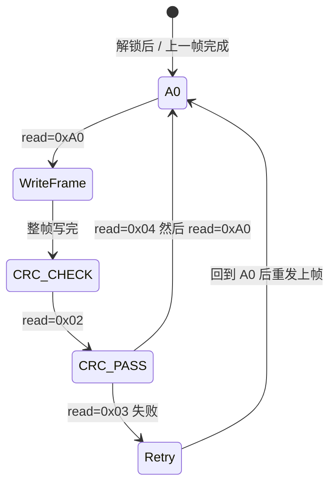
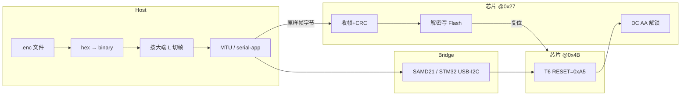

# enc 固件烧录与 I2C 写入分析报告

**源文件：** `ej/doc/ATMXT640UD_0x17_3.0.E3_PROD.enc`  
**抓包对照：** `ej/bit/enc.txt`  
**协议参考：** QTAN0051（`ej/doc/使用Host烧录FW文档Level2_QTAN0051_BX-Bootloader-20260514012450.md`）  
**工具：** MaxTouch Update Tool (MTU_250825A) + SAMD21 I2C 桥  
**芯片：** ATMXT640UD（Family 0xA6 / Variant 0x17 / V3.0.E3）

---

## 1. 总体结论

`.enc` 是 **Atmel 工具生成的加密固件分发文件**（十六进制 ASCII 文本）。完整链路为：

```text
.enc 文本 → Host 十六进制解码 → 按帧切分(大端 L) → I2C 原样写入 Bootloader@0x27
         → 芯片内解密/CRC/写 Flash → 复位回应用模式@0x4B
```

与 `.xcfg` 配置上传（见 `xcfg_upload_analysis.md`）的本质区别：

| 维度 | `.enc` 固件 | `.xcfg` 配置 |
|------|-------------|--------------|
| 内容 | 完整应用固件 | 触摸参数对象表 |
| Host 是否解密 | **否** | 明文编码即可 |
| I2C 模式 | 先进 **Bootloader 0x27** | 应用模式 **0x4B** 直写 RAM |
| 解锁 | `0xDC 0xAA` | T6 FREEZE `0x22` |
| 持久化 | Bootloader 写 Flash | T6 BACKUPNV `0x55` |

---

## 2. `.enc` 文件格式（分发层 → 二进制层）

### 2.1 文件是什么

- **格式：** 连续十六进制 ASCII 文本，**无** `ATML_VIH` 等明文头。
- **大小：** 约 370832 hex 字符 → **185416 字节**二进制流。
- **生成：** Atmel MaxTouch 工具链加密打包；Host **只负责传输，不解密**。

### 2.2 Host 第一步：文本解码

```python
hexstr = re.sub(r'\s+', '', open('xxx.enc').read())
binary = bytes.fromhex(hexstr)   # 185416 字节
```

**无额外编码变换**——解码后的二进制即为待发送的帧流。

### 2.3 帧结构（协议层，大端 16 位长度字 L）

每帧布局：

```text
[byte0][byte1] = L (big-endian, 16-bit)
[L 字节后续数据] = (L-2) 字节加密载荷 + 2 字节帧 CRC
整帧占用 = 2 + L 字节
```

- `L=0`：特殊帧，可作主机触发复位（QTAN0051 §3.4）。
- 本文件共 **1186 帧**，L 分布：

| L (hex) | L (dec) | 数量 | 整帧字节 | 用途 |
|---------|---------|------|----------|------|
| 0x0012 | 18 | 1 | 20 | 首帧（头/密钥类） |
| 0x0112 | 274 | 592 | 276 | 主固件大块（单芯片最大帧） |
| 0x0022 | 34 | 589 | 36 | 穿插短块（与 274 交替） |
| 0x0102 | 258 | 2 | 260 | 尾部收尾 |
| 0x0042 | 66 | 1 | 68 | 尾部 |
| 0x00D2 | 210 | 1 | 212 | 尾部（含复位语义） |

文件 hex 开头（与抓包帧 0 完全一致）：

```text
0012092305114D0CF0B660A88C06B2F2860B441C   ← 帧0, 20B
0112F3DDD3379A9959D7E734448701B4...167F   ← 帧1, 276B
00223818B9F3F014D0A06A63B6B0...            ← 帧2, 36B
```

### 2.4 Host 帧切分算法

```python
i = 0
while i + 2 <= len(data):
    L = (data[i] << 8) | data[i + 1]          # 大端
    if L == 0:
        yield data[i:i+2]
        i += 2
        continue
    frame = data[i:i + 2 + L]
    yield frame
    i += 2 + L
```

**Endian 说明：** 本仓库 `ATMXT640UD_0x17_3.0.E3_PROD.enc` 首帧以 `0012` 开头，即 **大端** L=18；与 MTU 工具及抓包一致。

---

## 3. I2C 地址与模式切换

### 3.1 地址表（本抓包 ADDR_SEL=High）

| 模式 | 7-bit I2C 地址 | 说明 |
|------|----------------|------|
| Application | **0x4B** | 正常运行，Object Protocol |
| Bootloader | **0x27** | 固件更新（mXT640UD-CC 系列，见数据手册 C.1） |

> 注：QTAN0051 通用表写 High=0x25；本器件/抓包实际为 **0x27**，以 Object Table 与 `enc.txt` 为准。

### 3.2 桥接架构（本抓包）

```text
PC (MTU) ──USB──► SAMD21 I2C 桥 ──I2C──► ATMXT640UD
```

本工程 **test-V1.7** 等价路径：PC (Electron Host) ──USB CDC──► **STM32** ──I2C──► 触摸芯片（见 `mxt_bridge.c` 中 Bootloader 大包写、`0xDC 0xAA` 转发）。

---

## 4. 进入 Bootloader（阶段 B → C）

### 4.1 应用模式预检 @0x4B

烧录前 MTU 扫描 I2C 地址，确认芯片在应用模式：

```text
read 0x24/0x25/0x26/0x27 → NAK
read 0x4A → NAK
read 0x4B → ACK
```

读 **Info Block @0x0000**：

```text
read 0x4B @0x0000 → A6 17 30 E3 20 14 30
                    │  │  │     │  │
                    │  │  │     │  └─ Matrix Y=20
                    │  │  │     └──── Matrix X=32
                    │  │  └────────── Ver 3.0, Build E3
                    │  └───────────── Variant 0x17
                    └──────────────── Family 0xA6
```

读 **Object Table**，定位 T6 Command Processor 运行时地址 **0x06CB**。

### 4.2 强制进入 Bootloader（QTAN0051 §2.2）

向 T6 对象 **偏移 0（RESET 字段）** 写 **0xA5**：

```text
write 0x4B @0x06CB: A5
```

等价于应用层：

```text
write 0x4B: CB 06 A5    # 16-bit 地址小端 0x06CB + 数据 0xA5
```

芯片复位后 I2C 从地址 **0x4B 切换到 0x27**，进入 Bootloader。

### 4.3 确认 Bootloader 状态 @0x27

扫描 Bootloader 地址：

```text
read 0x24/0x25/0x26 → NAK
read 0x27 → ACK  E0 B5 02
```

状态字节解析（QTAN0051 Table 3-3）：

| 返回值 | 二进制 | 状态 | 含义 |
|--------|--------|------|------|
| **0xE0** | `11nnnnnn` | WAITING_BOOTLOAD_CMD | bit7,6=1，等待解锁命令 |
| **0xA0** | `10nnnnnn` | WAITING_FRAME_DATA | bit7=1，可接收帧数据 |
| **0x02** | — | FRAME_CRC_CHECK | CRC 校验中，Host 等待 |
| **0x04** | — | FRAME_CRC_PASS | CRC 通过，等待回 A0 |
| **0x03** | — | FRAME_CRC_FAIL | CRC 失败，回 A0 后重发 |

本抓包 `E0 B5 02` 含义：

- `0xE0`：WAITING_BOOTLOAD_CMD
- `0xB5`：Bootloader ID（扩展读，bit5=1 时读附加字节）
- `0x02`：Bootloader Version 2
- MTU 日志：`Bootloader ID:181 (Version:2)` → ID 0xB502

---

## 5. 解锁（阶段 D）

Bootloader 模式下，发送 **Application Update Unlock Command**（QTAN0051 §3.1）：

```text
write 0x27: DC AA
read  0x27 → A0    # 进入 WAITING_FRAME_DATA
```

**仅此一次**；后续 1186 帧数据流不再重复发 `DC AA`（末帧密文中的 `DC AA` 字节仅为巧合，不是解锁命令）。

---

## 6. 帧传输：enc → I2C（阶段 E）

### 6.1 状态机循环（每帧）



每帧标准时序（以帧 0 为例）：

```text
read  0x27 → A0                              # 等待帧数据
write 0x27 → 00 12 09 23 05 11 4D ... 1C    # 20B 整帧（与 .enc 偏移0完全一致）
read  0x27 → 02                              # FRAME_CRC_CHECK
read  0x27 → 04                              # FRAME_CRC_PASS
read  0x27 → A0                              # 可发下一帧
```

### 6.2 I2C 写 = .enc 帧原样字节（仅物理拆片）

**关键：I2C 线上数据就是 `.enc` 解码后的帧字节，不做二次编码或解密。**

| 帧大小 | I2C 写次数 | 说明 |
|--------|-----------|------|
| ≤61B（如帧0=20B） | **1 笔** | 一次 write 发完整帧 |
| 276B（L=274） | **5 笔** | 61+61+61+61+32 续传 |
| 36B（L=34） | **1 笔** | 短帧一笔写完 |

大帧拆片规则（SAMD21/MTU 桥限制单包 ~61B）：

```text
write#1: [01 12][密文前59B]     ← 仅首笔含 2 字节长度头
write#2: [密文续传 61B]          ← 无地址、无新帧头
write#3: [密文续传 61B]
write#4: [密文续传 61B]
write#5: [密文尾 + CRC 32B]
```

**注意：** 续传包中出现的 `FC 02`、`80 22` 等是 **密文巧合**，不是 Bootloader 状态码或新帧头 `00 22`。

帧 1 抓包与 `.enc` 二进制逐字节对应（首笔）：

```text
.enc:  01 12 F3 DD D3 37 9A 99 ...
I2C:   01 12 F3 DD D3 37 9A 99 ...  (write#1, 61B)
```

### 6.3 进度与帧数

- MTU 进度条 1%~100% 对应 **1186 帧**全文件传输。
- 主体交替：**L=274（276B）** 与 **L=34（36B）** 约 592:589。
- 末帧组含 L=210、L=258 等收尾帧，内嵌芯片复位命令，完成后 Bootloader 退出。

### 6.4 芯片侧处理（Host 不可见）

Bootloader 收到每帧后：

1. 校验帧 CRC（2 字节尾）
2. 解密加密载荷
3. 写入内部 Flash
4. 通过状态字节 `02 → 04 → A0` 反馈 Host

Host **不参与**解密与 Flash 编程。

---

## 7. 烧录完成与回到应用模式（阶段 F）

末帧发送完成后：

```text
read 0x27 → NAK          # Bootloader 已退出
read 0x4B → ACK          # 新固件应用模式运行
read 0x4B @0x0000 → A6 17 30 E3 20 14 30   # Info Block 不变（同版本烧录）
```

**后续必要步骤：** 按 QTAN0051，固件更新后 Host 应 **重写 xcfg 配置/校准**（见 `ej/bit/xcfg.txt`）。

---

## 8. 完整流程时序（与 enc.txt 分段对应）

```text
阶段 A  MTU 进度 1%~100%（无 I2C 细节）
阶段 B  应用模式 0x4B：Info/Object Table 确认
        T6@0x06CB 写 RESET=0xA5 → 进 Bootloader
阶段 C  Bootloader 0x27：读 E0 B5 02 确认
阶段 D  解锁：write DC AA → read A0
阶段 E  1186 帧循环：read A0 → write 帧 → read 02→04→A0
阶段 F  0x27 NAK / 0x4B ACK，读 Info 验证
```



---

## 9. 本工程 USB 桥接路径（STM32）

除 MTU + SAMD21 直连外，本仓库支持 Host 经 STM32 CDC 烧录（见 `使用Host烧录FW文档Level2_QTAN0051_BX-Bootloader-20260514012450.md` §4）：

| 组件 | 路径 | 作用 |
|------|------|------|
| 上位机 | `serial-app` / Electron | 解析 `.enc`、`splitEncFrames`（优先大端 L） |
| IPC | `flash-bootloader-enc` | 选文件、发帧 |
| STM32 | `usbd_cdc_if.c` / bridge | `FORCEBL`、`0x53` Bootloader 大包写、`0xDC 0xAA` 解锁 |
| I2C | `mxt_i2c.c` | 转发至 0x27 |

与 MTU 抓包差异：

| 项目 | MTU + SAMD21 | STM32 桥 |
|------|--------------|----------|
| 进 BL | T6 0xA5 @0x4B | 可选 `FORCEBL` 或 T6 0xA5 |
| 拆片 | ~61B/笔 | 桥固件大包缓冲 |
| 帧内容 | .enc 原样 | .enc 原样（同样不解密） |

---

## 10. enc → I2C 对照示例

### 帧 0（20 字节，一笔写完）

| 层级 | 内容 |
|------|------|
| .enc 文本 | `0012092305114D0CF0B660A88C06B2F2860B441C` |
| 二进制 | `00 12` + 18 字节载荷 |
| I2C write @0x27 | `00 12 09 23 05 11 4D 0C F0 B6 60 A8 8C 06 B2 F2 86 0B 44 1C` |

### 帧 1（276 字节，五笔续传）

| 层级 | 首 4 字节 |
|------|-----------|
| .enc | `0112F3DD...` |
| I2C write#1 | `01 12 F3 DD ...`（61B） |
| I2C write#2~#5 | 密文续传，合计 276B |

---

## 11. 实现要点清单

自行实现 `.enc` 烧录工具时需满足：

1. **解码：** 去空白 → `bytes.fromhex()` → 185416B
2. **切帧：** 大端读 L，帧长 = 2+L，共 1186 帧
3. **进 BL：** 应用模式 T6 RESET=0xA5，或硬件 CHG/RESET 序列
4. **确认：** 读 0x27 得 `0xE0`（WAITING_BOOTLOAD_CMD）
5. **解锁：** `write 0x27: DC AA`，等 `read → A0`
6. **传帧：** 每帧前 `read=A0`；整帧原样 write；后 `read 02→04→A0`
7. **拆片：** 单包 ≤61B，仅首笔含长度头
8. **失败：** `read=03` 时在 A0 后重发上一帧
9. **完成：** 0x27 NAK + 0x4B ACK；必要时重写 xcfg

---

## 12. 结论

`ATMXT640UD_0x17_3.0.E3_PROD.enc` 是 **十六进制 ASCII 包装的加密帧流**；Host 编码仅 **`hex→binary→按大端 L 切帧`**，I2C 线上 **原样发送帧字节**。进入 Bootloader 靠 **T6 RESET=0xA5**；解锁靠 **`DC AA`**；1186 帧经 **A0→写→02→04→A0** 状态机写入；解密与 Flash 编程全在芯片 Bootloader 内完成。`enc.txt` 完整记录了 MTU 经 SAMD21 桥从应用模式到 Bootloader 再回应用模式的全链路，帧 0/帧 1 可与 `.enc` 文件逐字节验证。
