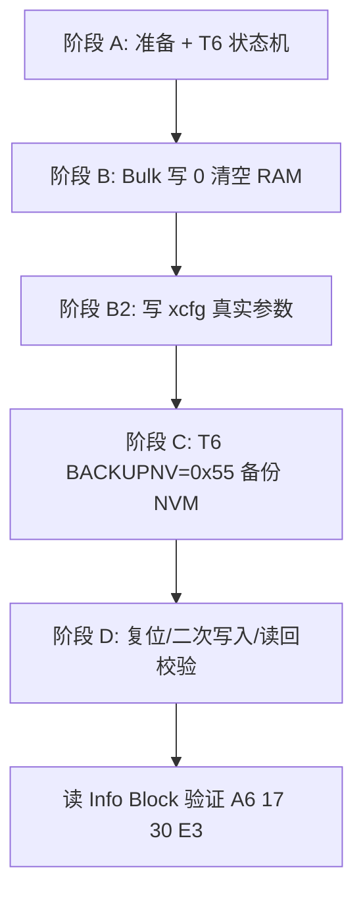

# xcfg 配置上传与 I2C 写入分析报告

**源文件：** `ej/doc/PICO_640UD_V3.0.E3_Initial_Config_20260429.xcfg`  
**抓包对照：** `ej/bit/xcfg.txt`  
**芯片：** ATMXT640UD（Family 0xA6 / Variant 0x17 / V3.0.E3，32×20）

---

## 1. 总体结论

`.xcfg` **不是二进制固件**，而是 **maXTouch Studio 导出的明文 ASCII 对象配置表**。上传过程本质是：

```text
.xcfg 文本 → 按对象/字段编码为 RAM 字节 → I2C Mem_Write 写入芯片 → T6 备份到 NVM
```

与 `.enc` 固件烧录（加密帧、Bootloader 协议，见 `ej/bit/enc.txt`）完全不同：**xcfg 无加密、无 Bootloader、直接在应用模式 0x4B 写配置 RAM**。

本工程还提供 **USB 桥接路径**（Host 解析 xcfg → CFGWRITE 二进制帧 → STM32 转 I2C），逻辑等价，但分块策略与 Studio 抓包略有不同。

---

## 2. `.xcfg` 文件结构

### 2.1 文件头（元数据，不直接写入设备）

```text
[VERSION_INFO_HEADER]
FAMILY_ID=166
VARIANT=23
VERSION=48
BUILD=227
MATRIX_X=32
MATRIX_Y=20
NO_OBJECTS=48
NO_DEVICES=1
...
CHECKSUM_DEVICE_0=0x9A70BB
INFO_BLOCK_CHECKSUM=0xCD623C
[FILE_INFO_HEADER]
VERSION=4
ENCRYPTION=FALSE
```

| 字段 | 值 | 含义 |
|------|-----|------|
| FAMILY_ID=166 | 0xA6 | mXT640 系列 |
| VARIANT=23 | 0x17 | 640UD |
| VERSION=48, BUILD=227 | 3.0 / 0xE3 | 固件版本 |
| ENCRYPTION=FALSE | — | **配置明文，不加密** |
| CHECKSUM_DEVICE_0 | 0x9A70BB | 写入完成后 T6 消息区应出现此校验 |

### 2.2 对象段（真正要编码写入的内容）

本文件共 **125 个对象实例**，RAM 地址范围 **1588 (0x0634) ~ 3920 (0x0F50)**，合计约 **2225 字节**配置数据。

每个对象段格式：

```text
[对象类型名 INSTANCE n]
OBJECT_ADDRESS=<十进制 RAM 地址>
OBJECT_SIZE=<字节长度>
<偏移> <长度> <字段名>=<十进制值>
```

示例（自电容调参 T110）：

```text
[SPT_SELFCAPTUNINGPARAMS_T110 INSTANCE 0]
OBJECT_ADDRESS=2285
OBJECT_SIZE=40
0 2 PARAMS[0]=131
2 2 PARAMS[1]=137
...
36 2 PARAMS[18]=0
38 2 PARAMS[19]=0
```

---

## 3. 编码规则（文本 → 设备字节）

**「编码」不是加密或压缩**，而是把字段值按 **小端序** 填入对象缓冲区。

### 3.1 算法

对每个 `[对象]`：

1. 分配 `buf[0 .. OBJECT_SIZE-1]`，默认全 **0**
2. 解析每一行 `偏移 长度 字段=值`
3. 将 `值` 按 **小端** 写入 `buf[偏移 .. 偏移+长度-1]`

伪代码：

```python
buf = bytearray(OBJECT_SIZE)  # 默认 0
for (offset, length, value) in fields:
    for i in range(length):
        buf[offset + i] = (value >> (8 * i)) & 0xFF
# I2C 写入地址 = OBJECT_ADDRESS
```

### 3.2 编码验证（T110 INSTANCE 0）

| xcfg 字段 | 十进制 | 小端字节 |
|-----------|--------|----------|
| PARAMS[0]=131 | 131 | `0x83 0x00` |
| PARAMS[1]=137 | 137 | `0x89 0x00` |
| PARAMS[2]=140 | 140 | `0x8C 0x00` |

抓包阶段 B2 首帧（地址 `ED 0x08` = 0x08ED = **2285**）：

```text
write 0x4B: ED 08 83 00 89 00 8C 00 8B 00 8E 00 ...
```

与 xcfg 编码结果 **完全一致**。

### 3.3 多字节字段规则

- **1 字节字段**（如 `CTRL=0`）：直接写单字节
- **2 字节字段**（如 `PARAMS[n]=131`）：低字节在前
- **未列出字段**：保持 0（Studio 常先 bulk 清零再写非零段）

---

## 4. I2C 传输层

### 4.1 基本参数

| 项目 | 值 |
|------|-----|
| 7-bit 地址 | **0x4B**（ADDR_SEL=High） |
| 协议 | maXTouch Object Protocol |
| 寄存器 | **16 位地址，小端先发** |
| 单帧最大载荷 | **59 字节 (0x3B)** |

### 4.2 地址字节序

抓包中 `CB 0x06` = 寄存器 **0x06CB**（T6 Command Processor，运行时地址，以 Object Table 为准）。

STM32 侧通过 `MXT_MEM_ADD` 做字节交换后交给 HAL（见 `USB_DEVICE/App/mxt/mxt_i2c.c`）。

### 4.3 典型 I2C 写格式

```text
START + 0x4B(W) + ADDR_LO + ADDR_HI + [payload...] + STOP
```

- `C0 0x06`：设 T5 读指针到 0x06C0（读消息/checksum 前）
- `CB 0x06 0x00 0x22 ...`：写 T6@0x06CB，offset1=0x22（FREEZE）
- `CC 0x06 0x55`：写 T6+1，BACKUPNV=0x55

---

## 5. 完整上传流程（`xcfg.txt` 抓包）

`xcfg.txt` 前半为说明，后半为 **maXTouch Studio 写该 xcfg 时的真实 I2C 抓包**，分四个阶段：



### 阶段 A — 准备与冻结（约 xcfg.txt 第 66~111 行）

| 步骤 | I2C 操作 | 含义 |
|------|----------|------|
| 1 | 读 0x0634 等 | 读状态/对象 |
| 2 | `C0 06` | 设 T5 指针 |
| 3 | `CB 06 00 33 ...` | T6 BACKUPNV=**0x33** 从 NVM 恢复旧配置 |
| 4 | 轮询 T6 直至 BACKUPNV 回 0 | 等待恢复完成 |
| 5 | `CB 06 00 22 ...` | T6 BACKUPNV=**0x22** **FREEZE**（改 RAM 前必须） |
| 6 | 轮询直至完成 | 读消息可见 checksum 状态 |

T6 命令字段（地址运行时多为 **0x06CB**）：

| 偏移 | 字段 | 常用值 | 含义 |
|------|------|--------|------|
| 0 | RESET | 0x00 | 不复位 |
| 1 | BACKUPNV | 0x33 | 从 NVM 恢复 |
| 1 | BACKUPNV | 0x22 | 冻结 FREEZE |
| 1 | BACKUPNV | 0x55 | 备份到 NVM |
| 4 | DEBUGCTRL | 0x20 | 可选调试 |

### 阶段 B — Bulk 清零（约第 113~177 行）

- 起始地址：**0x012A**（`2A 01`）
- 每帧 **59 字节全 0**，地址递增 **+0x3B**
- 覆盖约 **0x012A ~ 0x0FAF**，包含全部对象 RAM 区域（0x0634~0x0F50）

这是 Studio 的策略：**先大面积清零，再写非默认参数**，而非逐对象完整写入。

### 阶段 B2 — 写入 xcfg 真实参数（约第 311 行起）

按 **OBJECT_ADDRESS** 定向写入编码后的字节，长对象按 59 字节拆帧。

典型示例：12 个 T110 实例连续写入（0x08ED 起，每实例 40 字节），抓包可见 `0xF9 0x00`（PARAMS=249）、`0x02 0x00` 等与 xcfg 一致。

写入后 **读回验证**（如第 322~337 行 read 与 write 数据一致）。

### 阶段 C — 备份 NVM（约第 179~187 行）

```text
C0 06                    # 设 T5 指针
CC 06 55                 # T6 BACKUPNV = 0x55
read → 01 02 ...         # 备份进行中
```

### 阶段 D — 复位与校验（约第 189 行起）

- 软复位、二次配置微调
- `CB 06 00 11`：**UNFREEZE (0x11)**
- 再次 `CC 06 55` 备份
- 读 Info Block @0x0000 → **`A6 17 30 E3 20 14 30`**
- T6 消息区 checksum → **`BB 70 9A`**（小端 = 头文件 `0x9A70BB`）

---

## 6. 本工程 USB 桥接路径（CFGWRITE）

除 Studio 直连 I2C 外，本仓库 STM32 固件支持 Host 经 USB CDC 上传（见 `USB_DEVICE/App/mxt/mxt_config.h`、`mxt_bridge.c`）：

| 步骤 | USB 命令 | MCU 动作 |
|------|----------|----------|
| 1 | `0xD0` START + 对象 addr/size 表 | 自动 T6 FREEZE(0x22) |
| 2 | `0xD1` CHUNK × N | `MXT_I2C_Write(addr+offset, data)` |
| 3 | `0xD2` END | 确认完成 |
| 4 | `0x55` + CRC16 | BACKUPNV → NVM |
| 5 | `0x11` + CRC16 | UNFREEZE（可选） |

与抓包差异：

| 项目 | Studio 抓包 | CFGWRITE 桥接 |
|------|-------------|---------------|
| 分块 | 最大 256 字节/帧（`CFG_MAX_DATA_PER_FRAME`），按对象索引流式发送 |
| 对象上限 | MCU **预留 128** 槽位（`CFG_MAX_OBJECTS`）；上位机按 xcfg 实际对象数发送（如 PICO 125），须 ≤128 |
| 清零 | Host 编码时对象 buf 默认 0；可选 bulk 清零见 Studio 抓包 |
| 控制 | 直接 I2C 写 T6 | USB 发 0x22/0x55/0x11 |

---

## 7. xcfg vs enc 对比

| 维度 | `.xcfg`（本报告） | `.enc`（固件，见 enc.txt） |
|------|-------------------|---------------------------|
| 内容 | 触摸 **配置参数** | **完整固件** |
| 格式 | 明文 ASCII 对象表 | 十六进制 ASCII → 加密二进制帧 |
| 加密 | **FALSE** | Atmel 工具加密 |
| I2C 模式 | 应用模式 **0x4B** | 先进 Bootloader **0x27** |
| 协议 | Object RAM 直接写 | QTAN0051 帧协议 |
| 持久化 | T6 BACKUPNV=0x55 | Bootloader 写 Flash |

---

## 8. 实现要点清单

若需自行实现 xcfg 上传工具，需满足：

1. **解析** VERSION_INFO_HEADER，确认 FAMILY/VARIANT/VERSION 与芯片一致
2. **编码** 每个对象：`OBJECT_ADDRESS` + 小端 buf（默认 0）
3. **FREEZE** 后再写 RAM（T6 offset1 = 0x22）
4. **I2C 拆包** ≤59 字节/帧，16 位地址小端
5. **BACKUPNV**（0x55）写入 NVM
6. **校验** Info Block + CHECKSUM_DEVICE_0 = 0x9A70BB

---

## 9. 数据流总览

```text
┌─────────────────────────────────────────────────────────────┐
│  maXTouch Studio / Host 工具                                 │
│  读取 PICO_640UD_V3.0.E3_Initial_Config_20260429.xcfg       │
└──────────────────────────┬──────────────────────────────────┘
                           │ 解析 125 对象 × 字段行
                           ▼
┌─────────────────────────────────────────────────────────────┐
│  编码层：{addr, size, buf[]} — 小端、默认零填充               │
└──────────────────────────┬──────────────────────────────────┘
                           │
          ┌────────────────┴────────────────┐
          ▼                                 ▼
┌──────────────────┐              ┌──────────────────┐
│ Studio 直连 I2C   │              │ USB CFGWRITE      │
│ (xcfg.txt 抓包)   │              │ → STM32 → I2C     │
└────────┬─────────┘              └────────┬─────────┘
         │                                  │
         └──────────────┬───────────────────┘
                        ▼
         ┌──────────────────────────────┐
         │ I2C 0x4B: T6 FREEZE → 写 RAM   │
         │         → T6 BACKUPNV(0x55)   │
         └──────────────────────────────┘
                        ▼
              ATMXT640UD NVM 持久配置
```

---

## 10. 结论

`PICO_640UD_V3.0.E3_Initial_Config_20260429.xcfg` 是明文对象配置；编码即 **按偏移/长度小端填 buf**；`xcfg.txt` 记录了 Studio 通过 I2C 0x4B 完成 **FREEZE → 清零 → 写参 → BACKUPNV → 校验** 的完整时序，与 xcfg 内容可在 T110 等对象上逐字节对应验证。
